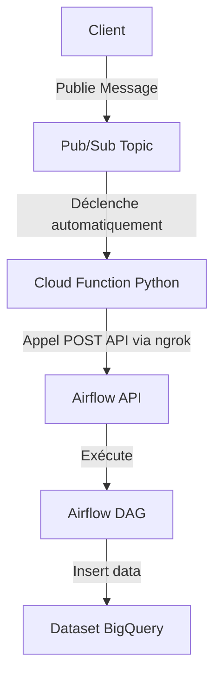

# Airflow & Google Cloud Platform Demo

Ce dépôt fournit une solution complète permettant de démarrer rapidement avec Apache Airflow, Google Cloud Platform (GCP), Pub/Sub, Cloud Functions et BigQuery. Le DAG Airflow est déclenché automatiquement lorsqu'un message est publié sur un topic Pub/Sub via une Cloud Function. L'API Airflow est exposée localement avec `ngrok` pour faciliter les tests.

---

## 🛠️ Prérequis

- [Google Cloud CLI](https://cloud.google.com/sdk/docs/install)
- [Terraform](https://developer.hashicorp.com/terraform/tutorials/aws-get-started/install-cli)
- [Docker & Docker Compose](https://docs.docker.com/get-docker/)
- [ngrok](https://ngrok.com/download)

---

## 📦 Installation

### 1. Configurer votre compte GCP

Créez un projet sur [Google Cloud Platform](https://console.cloud.google.com) et activez les APIs suivantes :

- Pub/Sub
- Cloud Functions
- Eventarc
- BigQuery

### 2. Initialisation de l'infrastructure avec Terraform

Ce dépôt inclut une configuration Terraform pour automatiser la création des ressources GCP nécessaires :

- Compte de service Airflow avec les rôles Pub/Sub et BigQuery.
- Topic et abonnement Pub/Sub.
- Dataset BigQuery.

Exécutez ces commandes depuis le dossier `terraform`:

```bash
terraform init
terraform apply
```

### 3. Démarrer Apache Airflow

Utilisez le fichier Docker Compose provenant de la [documentation officielle Airflow](https://airflow.apache.org/docs/apache-airflow/stable/howto/docker-compose/index.html) :

```bash
docker-compose up -d
```

Accédez à l'UI Airflow sur [http://localhost:8080](http://localhost:8080).

### 4. Exposer Airflow localement via ngrok

Exposez l'API Airflow via ngrok pour la rendre accessible depuis Google Cloud :

```bash
ngrok http 8080
```

L'interface web d'ngrok sera disponible sur [http://127.0.0.1:4040](http://127.0.0.1:4040).

### 5. Déployer la Cloud Function

Un script dynamique récupère automatiquement l'URL publique ngrok pour déployer la Cloud Function :

```bash
./deploy_trigger_airflow.sh
```

Créez un fichier `.env` dans le dossier `/scripts/trigger_airflow_dag` avec :

```env
AIRFLOW_USER=votre_user
AIRFLOW_PASS=votre_password
```

---

## 🚀 Fonctionnement Global (Mermaid)



---

## 🧪 Vérifications

- Consultez les logs de la Cloud Function sur [Google Cloud Console](https://console.cloud.google.com/functions).
- Vérifiez que le DAG Airflow est déclenché correctement depuis l'[UI Airflow](http://localhost:8080).
- Vérifiez les données insérées dans votre dataset BigQuery via [Google BigQuery Console](https://console.cloud.google.com/bigquery).

---

## 📚 Ressources complémentaires

- [Apache Airflow Documentation](https://airflow.apache.org/docs/apache-airflow/stable/)
- [Google Cloud Functions](https://cloud.google.com/functions)
- [Terraform Documentation](https://developer.hashicorp.com/terraform/docs)
- [ngrok Documentation](https://ngrok.com/docs)

---

## 📂 Structure du Projet

```
.
├── dags
│   └── giftcard_ingestion_dag.py
├── scripts
│   ├── deploy_trigger_airflow.sh
│   └── trigger_airflow_dag
│       ├── .env
│       └── main.py
└── terraform
    ├── main.tf
    └── variables.tf
```

---

## 📝 Remarques

- Pensez à arrêter `ngrok` après vos tests :

```bash
pkill ngrok
```

- Ne publiez jamais vos secrets (fichiers `.env`) dans le repository Git.

---

**Bon déploiement 🚀 !**

